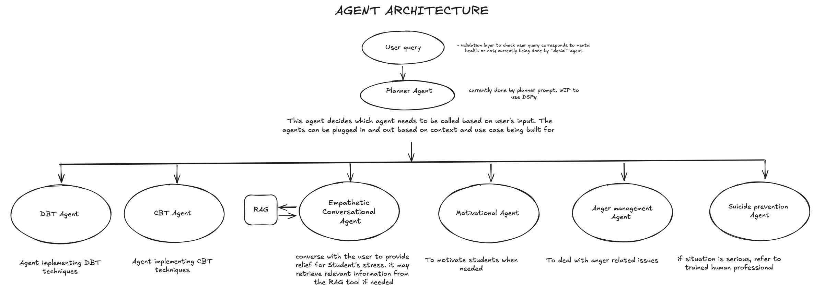

# Project Sukoon: Mental Health Support using AI


## Open Roles for Tech Tasks 

- [ ] Agent Building - help us build and refine current agents being used
- [ ] Agent Testing - help us do thorough testing of agents and workflow
- [ ] Evals - Improved accuracy and efficiency of the evaluation pipeline.
- [ ] Contribute in curating datasets and/or LLM Prompt Finetuning
- [ ] UI/UX improvements 
      
## Table of Contents

- [Vision](#vision)
- [Project Progress](#project-progress)
- [Installation](#installation)
- [Contributing](#contributing)
- [Documentation](#documentation)
- [Issues](#issues)
- [Pull Requests](#pull-requests)
- [Volunteer](#volunteer)

## Vision

Project Sukoon aims to build open-source solutions and standards for using AI to address mental health challenges. Our goal is to apply Digital Public Infrastructure (DPI) knowledge and practices to help professionals explore and understand the latest advancements in AI and their applications to mental health use-cases specific to India.

## 🚀 Project Progress

1. Prototyped with [Crew AI agent framework](https://www.crewai.com/)
2. Developed backend and frontend using [LangGraph framework](https://www.langchain.com/langgraph)
3. Tried [AutoGen framework](https://microsoft.github.io/autogen/docs/tutorial/introduction/) but due to web UI issues, did not deployed this
4. Completed v3 of our Sukoon chatbot and deployed in IIT Kanpur, others.
5. Created API endpoints for LangGraph and framework for integrating with WhatsApp API

[Watch the video](https://drive.google.com/file/d/1zFL8nz0d8aqzHxJhFU0h-ScDdFaSkPeT/view?usp=drive_link)

## Installation

### Technical Architecture


# LangGraph (`main` branch )
```
- clone the repo and create a virutal environement. Create a `.env` file and put in your secret keys like OpenAI keys
- install all dependencies in your environment (pip install -r requirements.txt)
- To use the API, run 'python sukoon_api.py'. else run `python.py` to run it in terminal
- To use web UI, cd to `sukoon-frontend`, run 'npm start' to access it in your browser. 
- There's a newer frontend version in `frontend-vite` folder. To use this, cd to this and run `npm run dev` to view it locally.
- alternatively use this vercel deployment to access it - https://sukoon-1.vercel.app (might be stopped in future)
```
## Steps to add environment variables - 
Create a .env file with:
```
OPENAI_API_KEY = '<YOUR_OPENAI_API_KEY>' 
ANTHROPIC_API_KEY = '<ANTHROPIC_API_KEY>'
LANGCHAIN_API_KEY = '<YOUR_LANGCHAIN_API_KEY>'
```
- Add portkey if you want to add observability

- Alternatively , try this:
```
On Mac/Linux -
export OPENAI_API_KEY=your_api_key_here

On Windows -
setx OPENAI_API_KEY "your_api_key_here"
```

# How to contribute 🤝
There are few ways you can contribute to Sukoon

- By providing feedback on the Sukoon Chatbot
- By helping in testing and evaluation(please find relevant code in `tests` and `evals` folder)
- By raising issues in the issues section
- By contributing to the codebase based on the issues
- Join the Sukoon team by filling the p+ai volunteer form ([https://peopleplus.ai/volunteer](https://coda.io/form/Volunteer-with-Us_dU44lQvPaxK?Type%20of%20Person=Volunteer&POC=David%20Menezes)) and select the Sukoon project.
- Submit PRs to the respective branches (e.g. 'icg' or 'langgraph')

For detailed guidelines, please read the guidelines outlined in CONTRIBUTING.md

The docs folder contains overall project documentation and related documents. To access or contribute to the documentation, please refer to docs/README.md.
e.g Please read the main doc here and feel free to add comments here - https://docs.google.com/document/d/1H8-oJmMy0r28kYup9vqt8VGDlY_cCFW_2M07XJxWpFU/edit?usp=sharing 

## Issues

If you encounter any issues with the project, please create a new issue using the issue template. Provide as much detail as possible to help us understand and resolve the issue.

# Current Challenges
We have three active discussions:
```
Develop a PII Removal Module
Optimizing Sukoon's Evaluation Pipeline
Improving Central Orchestrator Agent Classification in AutoGen System
```

# Current Landscape
Mental health support in India faces several challenges:

* Stigma and discrimination
* Lack of awareness
* Shortage of trained mental healthcare personnel
* Affordability issues
* Low budget allocation for mental healthcare

# What could a solution look like? (Future Vision) 
* Very personal approach with focus on listening and emphasising
* Available in 22 Indic regional languages, especially on mobile devices
* Stores the user conversation locally, not on cloud -> ensuring complete privacy
* Will provide helpful resources for most common mental health problems. However, it'll not prescribe any medicines
* For training the bot , we can use federated learning
* Aim is to get national-level adoption
* If serious, there’ll option to reach out to a psychiatrist or support community groups e.g. peer to peer network
* Have L1/L2/L3 level of support 

# Some interesting ideas to try: 
* Can we gamify the whole conversation? If yes, then how? 
* Can we nudge users to adopt emotionally healthier behaviour? 
* In particular, we can warn users about what not to do - relying on superstitions, isolation, labelling, and other unhelpful tactics
* Give positive self-affirmation, create safety plan, etc
* Can we develop Emotional Intelligence that understands not just emotions, but context behind it
* Can we create a timeline tracker let’s say six month plan for meditation and track streak
* Can we give them a phone number they can call to? The bot will mainly listen , empathize and offer safe advice

“Made for 🇮🇳 with ❤️ by People+AI”
